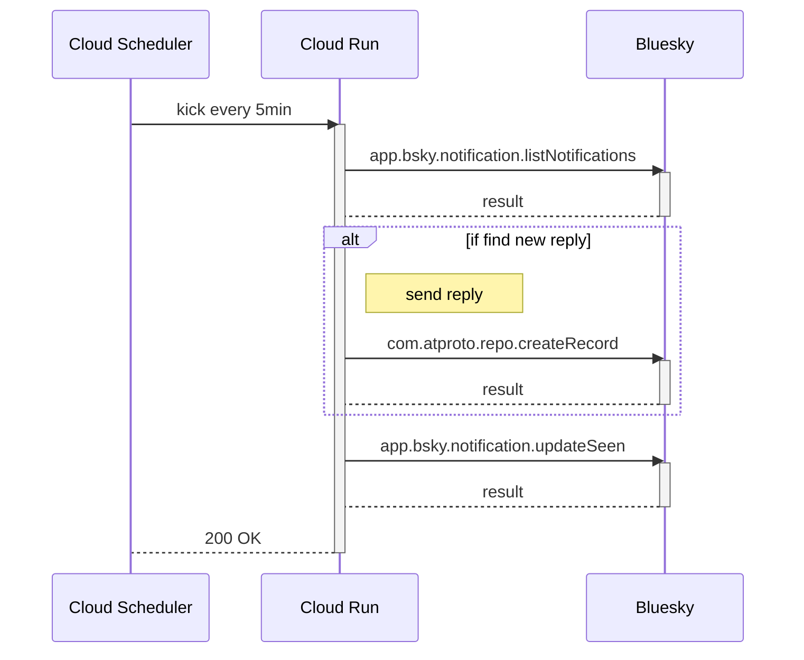

# vvvot (bot) living on Bluesky

[@vvvot.bsky.social](https://staging.bsky.app/profile/vvvot.bsky.social).

## Usage

### show your DID

```text
@vvvot.bsky.social did
```

Bot responses your [DID](https://atproto.com/guides/identity).

```text
Hi, @vvakame.bsky.social ! your DID is "did:plc:wh4o4bn5ppuxn7saotd2xqzm"
```

### show when your account was created (indexed) 

```text
@vvvot.bsky.social birthday
```

Bot responses when your account was created (indexed) at.

```text
your indexedAt is 2023-04-07 12:48:35 (UTC) / 2023-04-07 21:48:35 (JST)
```

## How does it work?

A simplified process flow is shown below.



### Why not use stream?

[see this](https://cloud.google.com/products/calculator/#id=7eae8fe9-3e43-48cc-b0c0-17b9f5b34c91)

> Total Estimated Cost: USD 44.71 per 1 month
